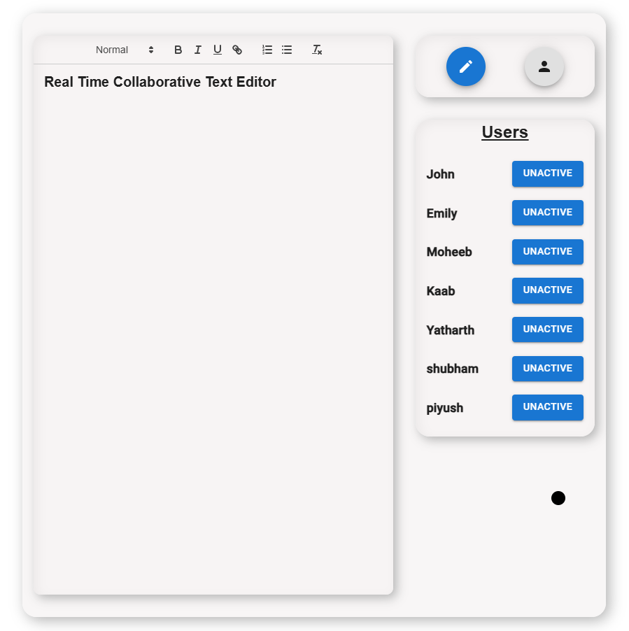

# Real-Time-Collaborative-Text-Editor
The real-time collaborative text editor is a web-based tool designed to facilitate simultaneous document editing among multiple users. Built with modern web technologies, it ensures real-time synchronization so that any changes made by one user instantly reflect on other users' screens. Key features include multi-user editing, live cursor tracking, and conflict resolution, which provide a smooth, interactive experience. This project leverages real-time communication protocols, enhancing team collaboration and productivity by enabling users to work together from different locations seamlessly. With an intuitive interface and efficient synchronization, this editor serves as a practical example of collaborative technology in action, meeting the increasing demand for shared, online workspaces.

---



---

## How to Run This Project Locally

Follow these steps to run the application on your system:

1. Clone this repository:
   ```bash
   git clone https://github.com/moheebk123/Real-Time-Collaborative-Text-Editor.git
   ```
2. Open the cloned repository in your preferred code editor.
3. Install the necessary dependencies in both - client and server, by running the following command:

   ```bash
   cd client
   npm install

   cd ..
   cd server
   npm install
   ```

4. Start the server in both client and server folder:
  - Open terminal for server folder and run the following command:
   ```bash
   npm start
   ```
   - Similarly, open the terminal for client folder without closing the server terminal and run the following command:
   ```bash
   npm run dev
   ```

5. Open your browser and navigate to:

   ```bash
   http://localhost:5173
   ```